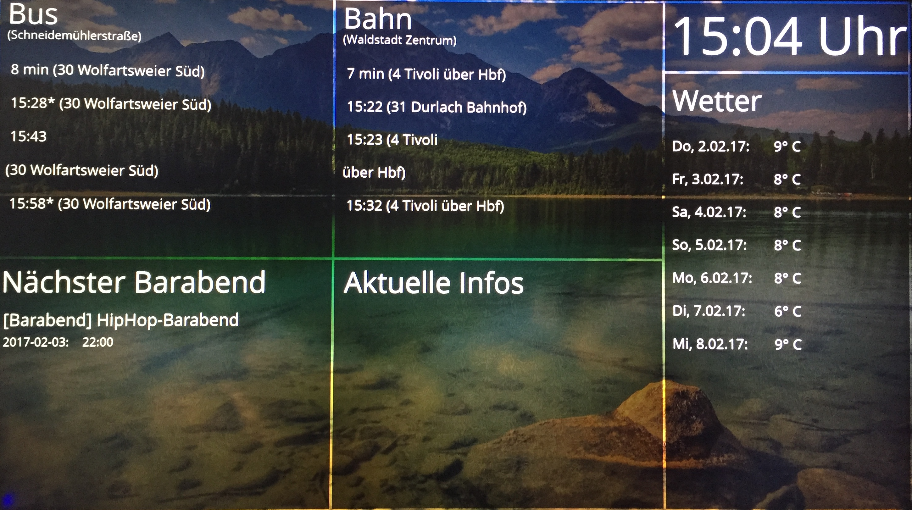

# insterBeamer
This is an Info-Beamer project for my dorm. 
<p align="left">
  
</p>
<sup>Uses [KVVLiveApi](https://github.com/cCirclEe/kvvliveapi) and [WeatherInfo](https://github.com/cCirclEe/weatherInfo) as data source.</sup>

#Installation

### TODO (before starting script):
- install python (should be installed already)
- ```sudo apt-get install mysql-server```
- ```apt-cache search MySQLdb```
- ```sudo apt-get install python-mysqldb```

- Language to de: for (ä,ö,ü) <b>IMPORTANT</b>
    - ```vim .bashrc``` -> add
    - ```export LANG="de_DE.UTF-8"```
    - ```export LC_ALL="de_DE.UTF-8"```

### Get GitHub repo:
- ```git clone git://github.com/cCirclEe/insterBeamer.git```
- in directory: <b>```/opt/insterBeamer/```</b>

### Start InfoBeamer at startup: 

- ```sudo su```
- ```vim /etc/init.d/myscript```
- #!/bin/sh --> /path/to/my/script.sh <b>OR</b> direct execution
- ```chmod ugo+x /etc/init.d/myscript```
- ```update-rc.d myscript defaults```
